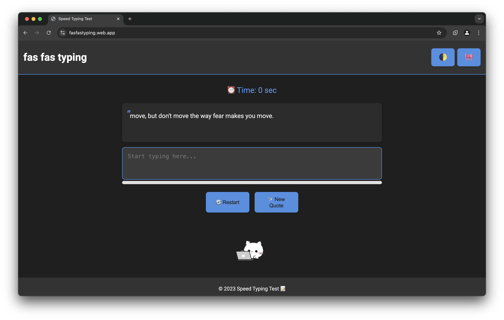
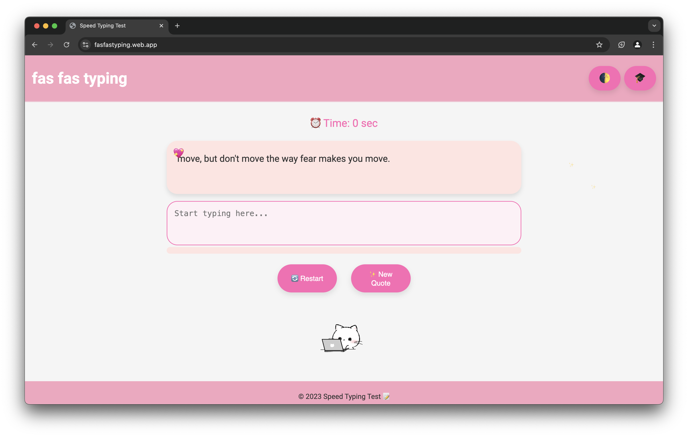
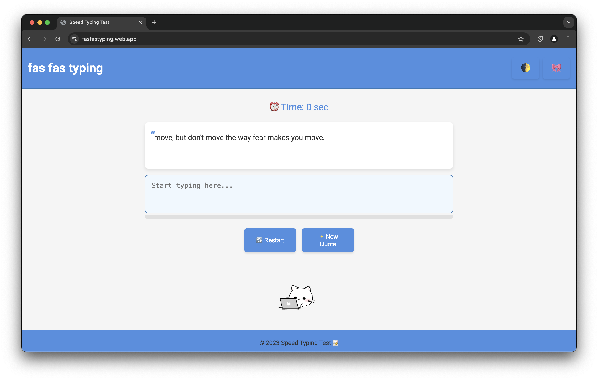

# Fas Fas Typing

## Introduction

**Fas Fas Typing** is an interactive web app designed to help users improve their typing speed and accuracy. Featuring a timer, progress bar, and real-time WPM calculation, it offers a fun and engaging way to practice typing.

## Features

- **Real-Time Timer:** Tracks typing duration.
- **Dynamic Quotes:** Provides random quotes for variety.
- **Progress Bar:** Visual feedback on typing progress.
- **WPM Calculation:** Displays words per minute upon completion.
- **Dark Mode:** Toggle between light and dark themes.
- **Responsive Design:** Works seamlessly on all devices.

## Demo

[Live Demo](https://fasfastyping.web.app)

## Installation

1. **Clone the Repository**
    ```bash
    git clone https://github.com/gauransh18/fasfastyping.git
    ```

2. **Navigate to the Directory**
    ```bash
    cd fasfastyping
    ```

3. **Open in Browser**
    Open `index.html` in your preferred web browser.

## Usage

- **Start Typing:** Begin typing the displayed quote.
- **Monitor Progress:** Watch the timer and progress bar.
- **View WPM:** See your typing speed after completion.
- **Customize:** Use the toggle buttons for dark mode and cute illustrations.
- **Controls:** Restart or get a new quote using the buttons provided.

## Technologies Used

- **HTML5 & CSS3:** Structure and styling.
- **JavaScript:** Functionality and interactivity.
- **Google Fonts:** Enhanced typography.
- **Canvas Confetti:** Celebrate achievements.

## Screenshots

### Desktop





## License

This project is licensed under the [MIT License](LICENSE).

## Contact

- **Email:** [gauransh@gauranshsharma.com](mailto:gauransh@gauranshsharma.com)
- **GitHub:** [gauransh18](https://github.com/gauransh18)

---
© 2024 **fasfastyping**
